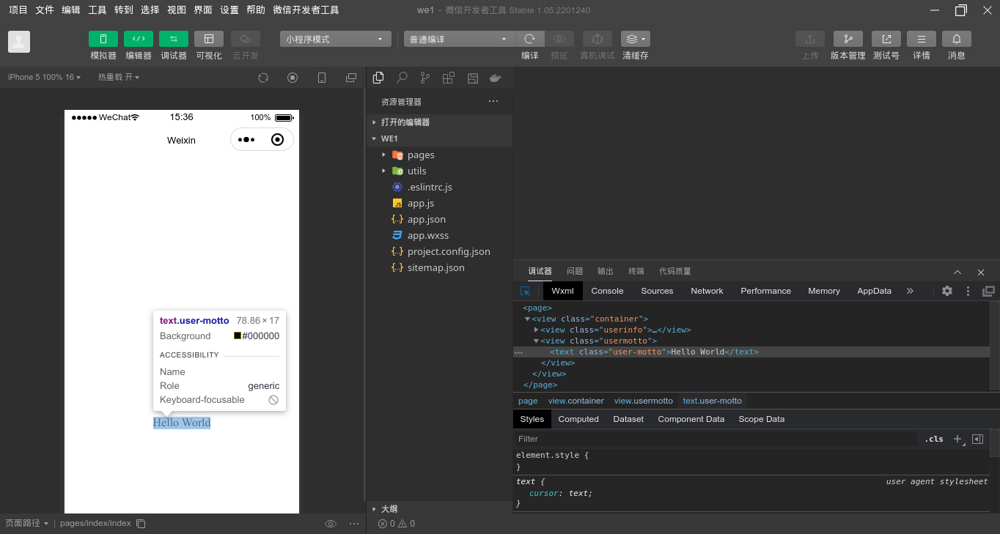
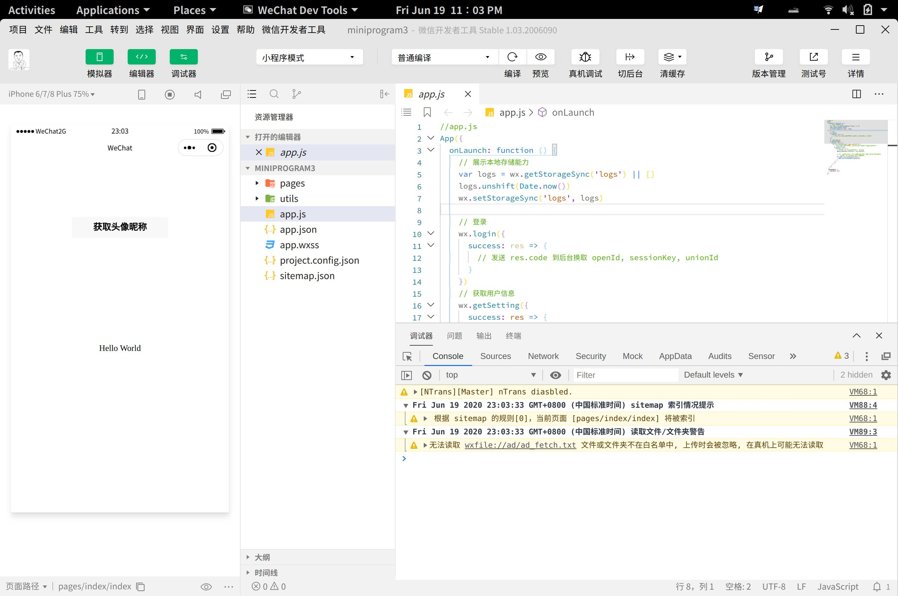
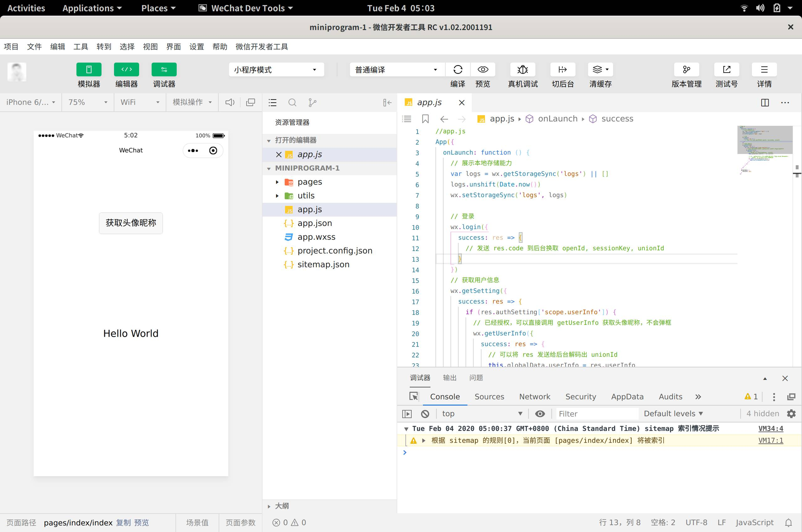

<div align="center">

  

  <h3>WeChat DevTools for Linux</h3>
    
[简体中文](./README.MD) | English
  
  <br>

----

[](https://github.com/msojocs/wechat-devtools-linux/actions/workflows/release.yml)
[](https://developers.weixin.qq.com/miniprogram/dev/devtools/download.html)
[](https://nwjs.io/downloads/)
[](https://nodejs.org/en/)
[](https://github.com/msojocs/wx-compiler)

  This is a Linux version of the WeChat DevTools.

  <br>
</div>

# Project Overview

This project provides scripts and tools to build and run the WeChat DevTools on Linux (GNOME desktop). It helps assemble the required NW.js / Node / native modules and packaging so the DevTools can be used and updated on Linux systems.

The project is adapted from https://github.com/dragonation/wechat-devtools/ and aims to make a working Linux distribution of the official WeChat DevTools.

# Project Repository

* https://github.com/msojocs/wechat-web-devtools-linux

# Progress

The current tool can build the latest version `2.01.2510280` on Linux, with CLI mode support.
You can now modify fonts directly in the settings interface by entering the font name manually.

`conf/config.latest.json` provides a `latest` experimental profile to freeze the latest NW.js / Node / native module version combinations; enable it by adding `--profile latest` to the script.

# Feature Test Records

[Test Records](docs/Features.MD)

Note:

These tests are only verified when fixing a particular feature, and do not guarantee normal usage on your system, as I do not have the resources to test each version release.

If you encounter any unsolvable issues, please open an [issue](https://github.com/msojocs/wechat-web-devtools-linux/issues/new/choose).

# System Requirements

* A Linux desktop system based on GNOME is preferred (other desktop environments may have issues; untested)
* CI auto-builds require specific glibc and libstdc++ versions: glibc >= 2.23, libstdc++ >= 3.4.21
* ~~If you download the `wine` version, you need `wine` and `wine-binfmt` support; version 5.0+ recommended~~

# CLI Support

The `bin` directory contains the `wechat-devtools-cli` script, which is the Linux version of the WeChat DevTools command-line support. Related documentation can be found on the [WeChat CLI Command Line V2](https://developers.weixin.qq.com/miniprogram/dev/devtools/cli.html) page.

# Usage

1. [Online Installation](#online-installation)
2. You can find pre-built packages in this project's [Release](https://github.com/msojocs/wechat-web-devtools-linux/releases).
   If the Release version has issues, try the [Continuous](https://github.com/msojocs/wechat-web-devtools-linux/releases/tag/continuous) version, which is built from the latest master branch commits and fixes bugs promptly, but may introduce new ones.
3. You can [build it yourself](#building-yourself)

# Online Installation

Currently supports the following platforms:

1. UOS App Store (deepin)

# Building Yourself

> Note:
> If you want to build the wine version, set the environment variable `export WINE=true`. Note: This is not supported.

## Method 0 (Recommended)

This method has a ~99% success rate; it may fail with unstable networks due to mirror availability limitations.

1. If building the `wine` version, install `wine` and `wine-binfmt` in your Linux environment first.
2. Install `docker` and `docker-compose`.
3. Clone this project:
    ```
    git clone --recurse-submodules https://github.com/msojocs/wechat-web-devtools-linux.git
    ```
4. Run the following command in your local project directory to build the DevTools:
    ```
    tools/build-with-docker.sh
    ```
5. (Optional) Run the following command to install the application icon:
    ```
    ./tools/install-desktop-icon-node
    ```

After that, you can launch WeChat DevTools by clicking the application icon or running `bin/wechat-devtools` from the command line.

## Method 1

Since `node-gyp` and `nw-gyp` are used, this method can encounter unpredictable issues due to `python` and `node` versions (e.g., no error messages but modules silently fail to build with node 15.0.1). However, the Docker build method handles these issues for you.

1. If building the `wine` version, install `wine` and `wine-binfmt` in your Linux environment first.
2. Install build dependencies for `nodegit`: `python2.7 python3.6+ libkrb5-dev gcc openssl libssh2-1-dev g++ make pkg-config`.
   
   Also, older `7z` versions may have issues (minimum version untested; e.g., the one in ubuntu16.04 doesn't work). See the [`Dockerfile`](docker/Dockerfile) for reference.
3. Clone this project:
    ```
    git clone --recurse-submodules https://github.com/msojocs/wechat-web-devtools-linux.git
    ```
4. Run the following command in your local project directory to build the DevTools:
    ```
    ./tools/setup-wechat-devtools.sh
    ```
5. (Optional) Run the following command to install the application icon:
    ```
    ./tools/install-desktop-icon-bash.sh
    ```

After that, you can launch WeChat DevTools by clicking the application icon or running `bin/wechat-devtools` from the command line.

# Differences from Other Linux WeChat DevTools Versions

1. Supports the latest version with continuous personal updates; new tags trigger automatic CI builds and Release uploads.
2. The core build process is completely open-source and can be modified.
3. Fixed NWjs Menu segmentation faults to ensure the latest version runs correctly (by dragonation).
4. Node modules are recompiled during the build to ensure native modules work correctly on Linux.
5. Update downloads support resumable transfers and use the Taobao domestic npm mirror for faster downloads (stability to be tested).
6. Pure Linux support using C++ to simulate the official compiler. [wx-compiler](https://github.com/msojocs/wx-compiler)

# Future Plans

See: [Processing Plan](https://github.com/msojocs/wechat-devtools-linux/projects?type=beta)

# Migration Related

See: [Migration Process Records](https://github.com/msojocs/wechat-web-devtools-linux/wiki)

# FAQ

## Skyline (Experimental Feature)

Start the Server, then click compile; the first time you start the Server you will get a wine configuration prompt, **no need to install mono**.

> [!Warning]
> Experimental feature; please open an issue for any problems. Thanks.
> Known issues: https://github.com/msojocs/skyline-client-server

```shell
docker run -d -it \
  --restart=always \
  --hostname="$(hostname)" \
  --env="DISPLAY" \
  --platform="linux/amd64" \
  --volume="${XAUTHORITY:-${HOME}/.Xauthority}:/root/.Xauthority:ro" \
  --volume="/tmp/.X11-unix:/tmp/.X11-unix:ro" \
  --volume="/dev/shm:/dev/shm" \
  -p 3001:3001 \
  --name skyline_server \
  ghcr.io/msojocs/skyline-client-server:master
```

For more, see: [FAQ](docs/FAQ.MD)

# Screenshots

Version 1.05.2201240


Version 1.03.2006090


Version 1.02.2001191


# Sponsor

If this repository makes you feel comfortable, you can star it or buy this ~~novice college student~~ worker a cup of coffee (please include your GitHub nickname if possible):


# Thanks for Sponsorship

Listed in reverse chronological order

| Sponsor | Date |
|---------|------|
| yinyu | 2026-01-03 |
| returning | 2025-07-12 |
| 👍 | 2025-07-10 |
| hanwor | 2025-06-17 |
| ... | 2025-03-29 |
| SakuraPuare | 2025-03-24 |
| [senseab](https://github.com/senseab) | 2024-12-21 |
| l | 2024-12-08 |
| lcurk0 | 2024-11-29 |
| [stvsl](https://github.com/stvsl) | 2024-11-26 |
| 仙人柱 | 2024-11-20 |
| [cabbage7th](https://github.com/cabbage7th) | 2024-10-06 |
| [shao4598](https://github.com/shao4598) | 2024-09-24 |
| [OWALabuy](https://github.com/OWALabuy) | 2024-08-28 |
| [wangvation](https://github.com/wangvation) | 2024-07-16 |
| 孤泉冷月 | 2024-07-12 |
| [liushuai05](https://github.com/liushuai05) | 2023-12-26 |
| LGTU | 2023-11-25 |
| [WRXinYue](https://github.com/WRXinYue) | 2023-11-09 |
| silentdoer | 2023-09-26 |
| ??? | 2023-08-11 |
| Geequlim | 2023-07-12 |
| 对方正在输入 | 2023-04-28 |
| @DaqiongYang | 2023-03-29 |
| AInoob | 2023-01-30 |
| ??? | 2023-01-18 |
| 仙人柱 | 2022-08-09 |
| [guanzhengyinqin](https://github.com/guanzhengyinqin) | 2022-07-14 |
| [nsfoxer](https://github.com/nsfoxer) | 2022-06-30 |
| [chiiihc](https://github.com/chiiihc) | 2022-06-17 |
| [younland](https://github.com/younland) | 2022-06-15 |
| [chiiihc](https://github.com/chiiihc) | 2022-06-14 |
| 陈陈菌 | 2022-05-29 |
| WWW | 2022-05-26 |
| 南极の短尾猫 | 2022-05-22 |
| 猪宝的猪 | 2022-05-15 |
| finalwhy | 2022-05-09 |
| [CoryByte](https://github.com/Corybyte) | 2022-04-23 |
| [Starrah](https://github.com/Starrah) | 2022-04-12 |
| [zyk-miao](https://github.com/zyk-miao) | 2022-04-12 |
| [icepie](https://github.com/icepie) | 2022-04-08 |
| Milder | 2022-03-23 |
| . | 2022-03-21 |
| shaoxp | 2022-03-16 |
| 李喆 | 2022-03-05 |
| david | ??? |

# Disclaimer

WeChat DevTools is copyrighted by Tencent Corporation. This project is for learning and communication purposes only. If there are any improprieties, please contact me at jiyecafe@gmail.com.

## Stargazers over time

[](https://starchart.cc/msojocs/wechat-web-devtools-linux)
