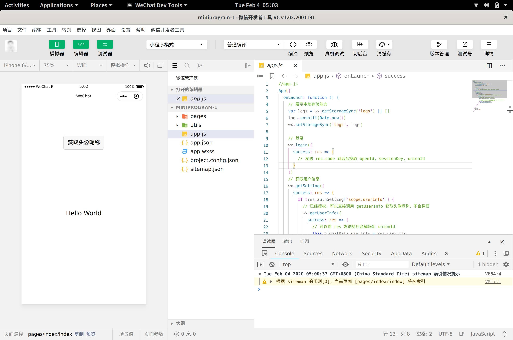

# 项目说明

本项目是一个完整的搭建Linux下可用的“微信开发者工具”的脚本和工具集，
用于在Linux下的GNOME桌面上搭建可以持续更新和使用的“微信开发者工具”。

# 进度

当前工具可以在Linux上构筑最新版1.02.2001191（截止时间2020年2月4日），但目前暂不支持CLI模式。

# 使用方法

可以在本项目的发布中，寻找已经构筑好了的`.tar.gz`包，下载解压后，运行其中的`bin/wechat-devtools`即可运行。

# 构筑方法

1. 请先在Linux环境中自行安装`wine`和`wine-binfmt`；
2. 请到[Mewchan网站](https://www.mewchan.com/dists.mhtml)上下载最新的运行时，
并配置到PATH环境变量中;
3. 克隆本项目：
```
git clone https://github.com/dragonation/wechat-devtools.git
```
4. 在本地项目目录中执行如下的语句，构筑开发者工具：
```
./tools/setup-wechat-devtools
```
5. 在本地项目目录中执行如下的语句，可以安装应用图标（非必须）：
```
./tools/install-desktop-icon
```

之后即可通过点击应用图标启动微信开发者工具，也可以运行`bin/wechat-devtools`通过命令行启动

# 与其他Linux下的微信开发者工具版本区别

1. 支持最新版本，并个人会持续更新，确保运行和测试OK才会上传Release；
2. 自己制作了一个看得过去的图标，官方的太丑了；
3. 核心构筑过程完全开源，可以自行修改；
4. 修复了nwjs上关于Menu的段错误，确保最新版本可以正常启动；
5. 在构筑过程中会重新编译node_modules，确保原生模块可以在Linux上正确运行；
6. 可以随时更新开发者工具中的node和nwjs版本；
7. 下载更新可以支持断点再续，并使用了taobao国内的npm源，加速下载；
8. 更新了编辑器字体，更好的支持Linux下的开发；
9. 使用了更为严谨的JS代码来控制整个构筑过程，避免Shell中出现的各类异常；
10. 手工做了一些VSCode编辑器界面的文字汉化（有些菜单很奇怪的腾讯没有汉化掉）。

# 后续计划

1. 提供CLI命令行支持
2. 增加Docker支持
3. 将`rebuild-node-modules`工具也改为`mew_js`代码

# 界面截图




# 免责声明

微信开发者工具版权归腾讯公司所有，本项目旨在交流学习之用。如有不当之处，请联系本人，邮箱：dragonation@gmail.com
