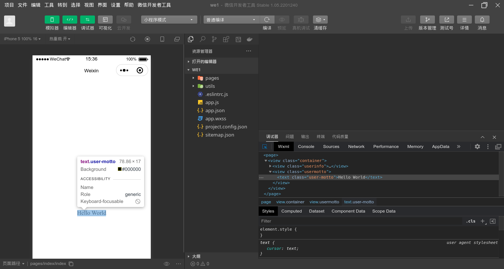
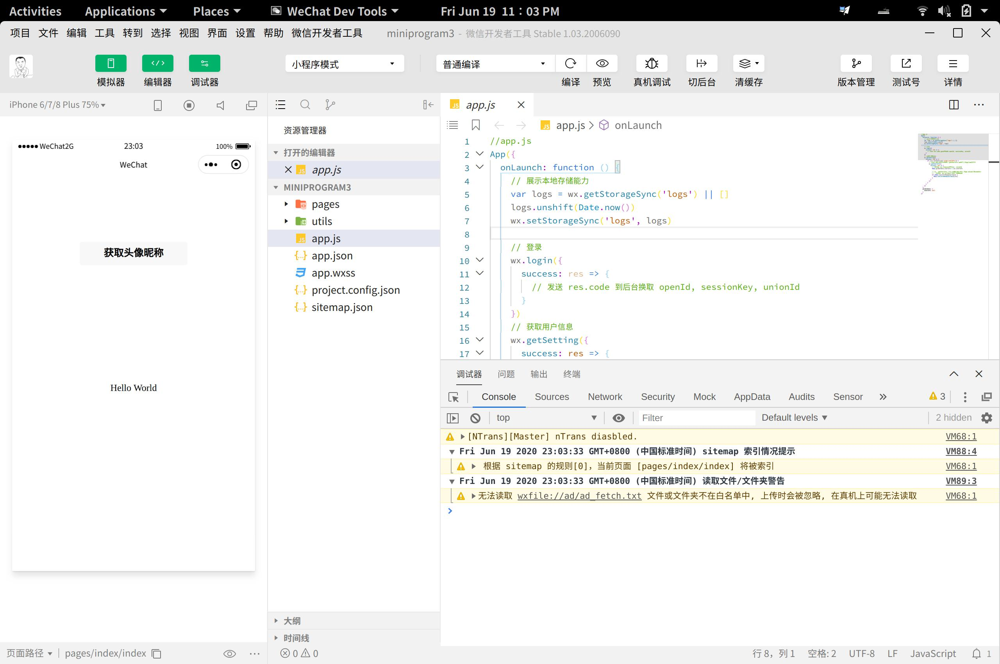

  
<div align="center">

  

  <h3>微信开发者工具 Linux版</h3>
  <br>

----

[](https://github.com/msojocs/wechat-devtools-linux/actions/workflows/release.yml)
[](https://developers.weixin.qq.com/miniprogram/dev/devtools/download.html)
[](https://nwjs.io/downloads/)
[](https://nodejs.org/en/)

  这是微信开发者工具 Linux版
  
  图标作者[dragonation](https://github.com/dragonation), 由于是基于其项目修改，未经授权。

  <br>
</div>

# 项目说明

本项目是一个完整的搭建Linux下可用的“微信开发者工具”的脚本和工具集，
用于在Linux下的GNOME桌面上搭建可以持续更新和使用的“微信开发者工具”。
本项目修改自：https://github.com/dragonation/wechat-devtools/

# 项目地址
* https://github.com/msojocs/wechat-devtools-linux

# 进度

当前工具可以在Linux上构筑最新版1.05.2201240（截止时间2022年1月26日），支持CLI模式，现已经有Docker支持（仅用于测试）。
另现在已经可以直接在设置界面里面修改字体，手工输入字体名称就可以。

# 功能测试记录

[测试记录](docs/Features.MD)

# 使用方法

可以在本项目的[发布](https://github.com/msojocs/wechat-devtools-linux/releases)中，寻找已经构筑好了的`.tar.xz`包，下载解压后，运行其中的`bin/wechat-devtools`即可运行。

# 系统要求

* 基于Linux的桌面系统，首选GNOME（其他的桌面环境可能会有问题，未测试）
* 安装有wine支持，建议版本在5.0以上，低版本可能会存在有问题
* 非兼容版对glibc和libstdc++有一定的版本要求，glibc的版本要求2.3，libstdc++的版本要求3.4.26，发布包里已经预编译了的Linux原生Node模块有这个依赖。兼容版本对这两个系统库的要求则较低，如果发现非兼容版本运行有问题可以考虑尝试切换到兼容版本

# CLI支持

在项目的`bin`目录中有`wechat-devtools-cli`命令，是微信开发者工具的命令行支持Linux版本。相关资料可以在[微信CLI命令行V2](https://developers.weixin.qq.com/miniprogram/dev/devtools/cli.html)上找到。

# Docker支持

为了尽可能正常的在Docker内运行完整的微信开发者工具，我们在Docker镜像内提供了GUI界面的支持。但该支持有严格的系统要求，因微信开发者工具的新版本对界面UI的图形化要求较高，导致该部分对OpenGL有必要的需求。所以Container内镜像的图形驱动要求与Host的图形驱动**完全**一致，在非一致的情况下，界面会出现频闪现象。即使是关闭了硬件加速，采用了--use-gl=swiftshader的软件模拟情况下也会出现图片撕裂的情况。因此，请各位在自行构筑Docker镜像时，严格根据自己使用的Linux发行版修改基础镜像。

目前图形界面在Docker内部实现的方案是通过X11的套接字透传实现的，因此请记得准备好一些必要Docker准备。大部分工作已经`bin/wechat-devtools-docker`命令中完成。但是请根据具体运行情况修改必要的参数和Docker镜像构筑脚本。鉴于Docker镜像的基础Linux版本较低，因此建议使用兼容版本的发布包来构筑镜像，而不要轻易使用非兼容版本。

Docker容器启动方法
```
./bin/wechat-devtools-docker
```

如需要映射外部目录，请自行修改Docker启动命令

# 构筑方法0（推荐）

理论上此方法99%成功;在网络不稳定时容易失败（原因懂得都懂）

1. 请先在Linux环境中自行安装`wine`；
2. 请安装`docker` `docker-compose`
3. 克隆本项目：
```
git clone https://github.com/msojocs/wechat-devtools-linux.git
```
4. 在本地项目目录中执行如下的语句，构筑开发者工具：
```
docker-compose up
```
5. 在本地项目目录中执行如下的语句，可以安装应用图标（非必须）：
```
./tools/install-desktop-icon-node
```

之后即可通过点击应用图标启动微信开发者工具，也可以运行`bin/wechat-devtools`通过命令行启动

# 构筑方法1

由于使用到`node-gyp` `nw-gyp`，此方法会受`python`、`node`版本影响出现一些难以预料的异常（比如使用`node15.0.1`时，大部分模块构建会被忽略，但没有任何报错信息）。但是，`Docker`构建方式会帮你处理好这些问题。

1. 请先在Linux环境中自行安装`wine`；
2. 请安装nodejs，并配置到PATH环境变量中，版本不限;
3. 克隆本项目：
```
git clone https://github.com/msojocs/wechat-devtools-linux.git
```
4. 在本地项目目录中执行如下的语句，构筑开发者工具：
```
./tools/setup-wechat-devtools-bash
```
5. 在本地项目目录中执行如下的语句，可以安装应用图标（非必须）：
```
./tools/install-desktop-icon-node
```

之后即可通过点击应用图标启动微信开发者工具，也可以运行`bin/wechat-devtools`通过命令行启动

# 与其他Linux下的微信开发者工具版本区别

1. 支持最新版本，并个人会持续更新，在添加新的tag时，actions会自动构建并上传Release；
2. 自己制作了一个看得过去的图标，官方的太丑了；
3. 核心构筑过程完全开源，可以自行修改；
4. 修复了nwjs上关于Menu的段错误，确保最新版本可以正常启动；
5. 在构筑过程中会重新编译node_modules，确保原生模块可以在Linux上正确运行；
6. 可以随时更新开发者工具中的node和nwjs版本；
7. 下载更新可以支持断点再续，并使用了taobao国内的npm源，加速下载；
8. 使用了更为严谨的JS代码来控制整个构筑过程，避免Shell中出现的各类异常。

# 后续计划

1. 增加Docker镜像的稳定性（对Host要求比较高）
2. [处理计划](https://github.com/msojocs/wechat-devtools-linux/projects?type=beta)

# FAQ
[GO](docs/FAQ.MD)

# 界面截图

版本 1.05.2201240


版本 1.03.2006090


版本 1.02.2001191


# 免责声明

微信开发者工具版权归腾讯公司所有，本项目旨在交流学习之用。如有不当之处，请联系本人，邮箱：jiyecafe@gmail.com
